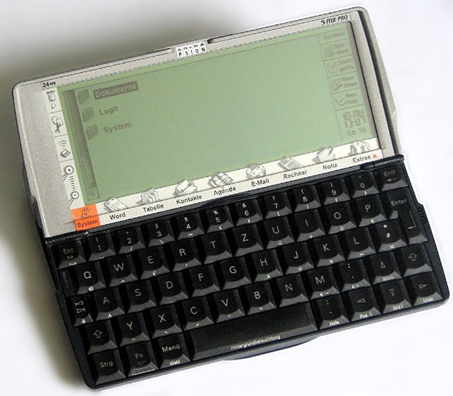
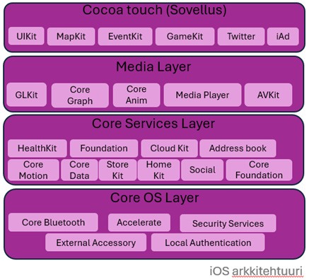

# Mobiiliohjelmoinnin perusteet


## Lyhyt historia ja mobiiliohjelmoinnin kehitys

Mobiiliohjelmoinnin alkupiste on 1990-luvulla erilaisten digitaalisten kämmenlaitteiden (PDA, Personal Digital Assistant) ohjelmoinnissa ja sovellusten tekemisessä. Tuon ajan mobiililaitteissa laskentateho ja muistin määrä olivat hyvin rajallisia. Tämä vaati käyttöjärjestelmissä ja sovelluskehityksessä erilaista lähestymistapaa verrattuna saman ajan tietokoneiden ohjelmointiin. Myös laitteiden akkujen pieni kapasiteetti asetti osaltaan rajoituksia ja ohjelmistokehityksessä oli huomioitava mahdollisimman energiatehokas lähestymistapa. Muun muassa näiden seikkojen vuoksi mobiiliohjelmointia alettiin tuolloin käsitellä omana ohjelmoinnin osa-alueena.

 Photo Credit: D. Travis \"Coplan\" North, April 25, 2006. Public domain

Alkuvaiheen mobiililaitteissa oli yleensä laitteen valmistajan oma käyttöjärjestelmä, kuten Palm kämmenlaitteiden PalmOS ja Psion laitteiden EPOC5 käyttöjärjestelmä. Laitteiden ohjelmointi tapahtui tyypillisesti C/C++ -ohjelmointikielillä ja niissä ei tavallisesti ollut sisäänrakennettua mobiilidatayhteyttä, vaan tiedot synkronoitiin pöytätietokoneelta sarjaportin tai infrapunayhteyden avulla.

 Photo Credit: Georg Dembowski Schoschi - Own work. Public domain

Ensimmäiset älypuhelimet tulivat markkinoille 1990-luvun lopulla ja niissä kämmenlaitteiden ominaisuuksiin yhdistyivät puhelin- ja verkkoyhteydet. 2000-luvun alussa EPOC6 julkaistiin uudella nimellä SymbianOS, josta tuli mm. Nokia-älypuhelinten pääasiallinen käyttöjärjestelmä vuosille 2000-2012.

Symbian-sovellusohjelmointi tapahtui C++ -ohjelmointikielellä, jossa käytettiin tietynlaista omaa tapaa koodin muotoilussa. Symbianiin liittyi käsitteitä, kuten aktiiviset objektit, siivouspino jne., jotka eivät ole perus C++ -ominaisuuksia. Mobiilisovellusten koodaamisen aloituskynnys oli Symbianin kohdalla suhteellisen korkea ja sovelluskehitys oli verrattain monimutkaista. Viimeisimmissä Symbianin versioissa 2010-luvun alussa käyttöliittymän tekemiseen käytettiin Qt-käyttöliittymäkirjastoa ja ohjelmointi tapahtui standardi C++-kielellä.

Mobiiliohjelmoinnin ja -käyttöjärjestelmien tilanne muuttui merkittävästi 2000-luvun ensimmäisen vuosikymmenen lopulla, kun Apple esitteli vuonna 2007 oman mobiilikäyttöjärjestelmänsä iOS:n ja vastaavasti Google vuonna 2008 Android käyttöjärjestelmän. Keskustelu siirtyi pelkistä käyttöjärjestelmistä ja kehitystyökaluista mobiiliekosysteemeihin ja mukaan tulivat tärkeänä osana sovelluskaupat (Google Play ja Apple App Store), joista laitteiden käyttäjän pystyivät ostamaan ja lataamaan uusia sovelluksia puhelimiinsa. Sovelluskehittäjän kannalta näistä sovelluskaupoista tuli keskeinen tapa jakaa omaa sovellusta asiakkaille. Muutaman vuoden kuluessa julkistuksista kävi selväksi, että edellä mainitut kaksi ekosysteemiä tulisivat jakamaan markkinan. Vuonna 2024 markkinaosuudet jakaantuvat siten, että Apple iOS:n osuus markkinoista maailmanlaajuisesti on 27,7 % ja Google Androidin osuus 71,9 % [Mobile Operating System Market Share Worldwide \| Statcounter Global Stats](https://gs.statcounter.com/os-market-share/mobile/worldwide).


## Käyttöjärjestelmät

Molemmat suosituista mobiilikäyttöjärjestelmistä ovat Unix-tyyppisiä järjestelmiä. Erona Applen iOS:n ja Googlen Androidin välillä on se, että iOS on Applen kehittämä suljettu järjestelmä ja Android taas avoimeen lähdekoodiin perustuva järjestelmä. Toisaalta useimmat myytävät laitteet sisältävät Googlen toimittaman suljetun Android version, jossa on Googlen kehittämiä suljettuja lisäosia.

Applen käyttöjärjestelmän, iOS:n, ydin on nimeltään Darwin. Se on Unix-tyyppinen järjestelmä ja käytössä kaikissa Applen järjestelmissä kuten macOS, watchOS, tcOS jne. Vastaavasti Googlen Android-käyttöjärjestelmä perustuu muokattuun versioon Linux-ytimestä. Molempien käyttöjärjestelmien rakenne on kerrosteinen, mikä selviää hyvin oheisista kuvista.



By Smieh - Anatomy Physiology of an Android, CC BY-SA 3.0, https://commons.wikimedia.org/w/index.php?curid=20067152

Androidissa ohjelmointikielenä käytetään Javaa ja Kotlinia ja kehitysympäristö, jossa sovellukset tehdään, on nimeltään Android Studio. iOS:n kanssa ohjelmointikielet ovat vastaavasti Swift ja Objective-C ja kehitysympäristö on Applen XCode.


## Mobiiliohjelmointi

Mobiiliohjelmointi voidaan jakaa natiiviin ja alustariippumattomaan (cross-platform) sovelluskehitykseen. Natiivilla sovelluksella tarkoitetaan sovelluksia, jotka on tehty nimenomaan tiettyä käyttöjärjestelmää varten käyttäen tämän järjestelmän kehitystyöhön tarkoitettuja työkaluja. Käytännössä tämä tarkoittaa Andoid Studiolla Android käyttöjärjestelmälle tehtyjä sovelluksia ja vastaavasti XCode ympäristössä iOS:lle tehtyjä sovelluksia.

Natiivin sovelluksen etuina voidaan pitää laiteresurssien tehokkaampaa käyttöä. Natiivi sovellus käyttää suoraan käyttöjärjestelmän palveluja eikä sitä sellaisenaan voida siirtää toimimaan eri käyttöjärjestelmän päällä. 

Sovelluskehityksen kannalta natiivien sovellusten tekeminen tarkoittaa sitä, että työ joudutaan ainakin osittain tekemään kahteen kertaan eli oma sovellus Androidille ja oma sovellus iOS:lle. Tämä lisää kustannuksia, niin sovelluksen kehitysvaiheessa, kuin myöhemmin sovellusta ylläpidettäessä. Toisaalta jos kehitettävä sovellus on verrattain pieni, tällä ei ole niin suurta merkitystä. 

Natiivisovellus päädytään tekemään useimmiten tilantessa, joissa halutaan käyttää mahdollisimman tehokkaasti käyttöjärjestelmän alimman tason palveluja (esim. navigointi, kamera, bluetooth) ja tilanteissa, joissa toteuttetava sovellus tulee olemaan jatkuvasti päällä loppukäyttäjän laitteessa ja halutaan optimoida sovelluksen aiheuttamaa virrankulutusta.

Alustariippumaton kehitys puolestaan tarkoittaa sitä, että sovellus kirjoitetaan ohjelmointikielellä, jota voidaan suorittaa useammassa eri käyttöliittymäympäristössä tai käytetään kehitystyökalua, jossa voidaan yhdestä lähdekoodista kääntää sovellus useammalle eri käyttöjärjestelmälle.

Ensin mainitusta tilanteesta esimerkkinä toimii React Native, joka on avoimen lähdekoodin ohjelmistokehys käyttöliittymäsovellusten tekemistä varten. Sovellukset kirjoitetaan JavaScript-ohjelmointikielellä ja sama sovellus voidaan julkaista sekä AppStore, että Google Play Store sovelluskaupoissa.

Jälkimmäisestä tilanteesta esimerkkinä voidaan käyttää Googlen Flutter-kehitysympäristöä, jossa sovellus kirjoitetaan Dart-ohjelmointikielellä. Flutterin lisäksi tarvitaan Android Studio-kehitysympäristö, jotta Dart-kielellä  toteutetusta ohjelmakoodista saadaan käännettyä Android-sovellus tai Applen XCode, jotta samasta Dart-sovelluksesta saadaan käännettyä iOS-sovellus. Lopputuloksena yhdestä sovelluskoodista saadaan tuotettua siis sovellus kahdelle eri käyttöjärjestelmälle ja sovellukset toimivat ainakin lähes natiivin sovelluksen tapaan. 


## React Native perusteet ja Expo Snack

React Native on Meta:n kehittämä avoimen lähdekoodin JavaScript-käyttöliittymäkirjasto mobiililaitteille. Helpoin tapa kokeilla React Native-sovelluksen tekemistä ja ehkä mobiiliohjelmointia ylipäätään, on hyödyntää selaimessa toimivaa [Expo Snack](https://snack.expo.dev/) koodieditoria ja emulaattoria.

Sivustolle voi helposti luoda oman käyttäjätilin, jolloin omien sovellusten tallentaminen on mahdollista. Tämä ei kuitenkaan ole pakollista ja kokeilemaan pääsee hyvin ilman käyttäjätiliäkin.


React Native-sovelus kirjoitetaan App.js -tiedostoon (1.) ja sivustolla on oletuksena valmiina pieni sovellus tässä tiedostossa. Sovelluksen toimintaa mobiililaitteessa pääsee kokeilemaan klikkaamalla sivustolla näkyvän matkapuhelimen 'Launch Snack'-painiketta (2.). Tämän esimerkin kohdalla voit aluksi poistaa kaiken koodin editorista (klikkaa tekstin päällä neljä kertaa ja valitse näppäimistöltä 'Delete'). Seuraavassa käydään läpi pala palalta oman esimerkkisovelluksen tekeminen ja voit kopioida esimerkkikoodin editoriin osa kerrallaan.

Oma esimerkki aloitetaan sisällyttämällä (import) siihen osia React ja React Native -kirjastoista. Tässä ensimmäisellä rivillä otetaan mukaan React JavaScript-kirjasto ja sieltä useState-toiminto. Tämän toiminnon avulla sovellus saadaan reagoimaan painikkeen painalluksiin ja sovelluksen näkymä saadaan päivitettyä aina kun käyttäjä klikkaa (tai koskettaa) painiketta.

Toisella rivillä otetaan mukaan React Native -toimintoja. 'View' on käyttöliittymän perusrakennuspalikka, jonka päälle muita osia kootaan. 'Text' tarvitaan tekstin näyttämiseen näytöllä. 'TouchableOpacity' puolestaan tarvitaan siihen painiketoiminnalisuuden lisäämiseksi sovellukseen.


```JSX
import React, { useState } from "react";
import { View, Text, TouchableOpacity, StyleSheet } from "react-native";
```

Seuraavassa esitellään sovelluksen (app) toiminnot. Itsemääritellyille muuttujille ja funktioille on käytetty suomenkielisiä nimiä, jotta ne erottuvat paremmin ohjelmointikielen omista rakenteista.

Ohjelman alussa määritetään tyhjä lista 'pisteet' ja pisteiden lisäämiseen tarkoitettu funktio 'lisaaPisteet'. Näiden tilan muuttuminen saadaan tässä aiheuttamaan sovelluksen näkymän uudelleepiirto 'useState'-toiminnallisuuden avulla.

Tämän jälkeen määritetään funktio 'kasittelePainike', jonka avulla saadaan lisättyä painikkeen pistemäärä listarakenteeseen 'pisteet' ja funktio 'laskeKeskiarvo', joka suorittaa listarakenteeseen 'pisteet' lisättyjen lukuarvojen keskiarvon laskennan ja palauttaa lopuksi lasketun keskiarvon kahden desimaalin tarkkuudella.

'App' funktio palauttaa return-komennon sisällä käyttöliittymän näkymän. Näkymä on rakennetty käyttäen edellä esiteltyjä 'View', 'Text', ja 'TouchableOpacity' komponentteja. Painikkeet lisätään erilliseen 'View'-komponenttiin, jolle käytetään myöhemmässä koodiosiossa määriteltävää 'painikeKehikko'-tyyliä.

```JSX
export default function App() {
  const [pisteet, lisaaPisteet] = useState([]);
  
  // Tämä funktio käsittelee painikkeiden painallukset
  const kasittelePainike = (pistemaara) => {
    lisaaPisteet([...pisteet, pistemaara]);
  };
  
  // Tämä funktio palauttaa annettujen pisteiden keskiarvon
  const laskeKeskiarvo = () => {
    if (pisteet.length === 0) return 0;
    const summa = pisteet.reduce((acc, val) => acc + val, 0);
    return (summa / pisteet.length).toFixed(2);
  };

  // Tässä rakennetaan käyttöliittymän näkymä
  return (
    <View style={tyylit.kehikko}>
      <Text style={tyylit.otsikko}>Anna palautetta</Text>
      
      {/* Tehdään painikkeet */}
      <View style={tyylit.painikeKehikko}>
        {[1, 2, 3, 4, 5].map((pistemaara) => (
          <TouchableOpacity
            key={pistemaara}
            style={[tyylit.painike, { backgroundColor: haePainikkeenVari(pistemaara) }]}
            onPress={() => kasittelePainike(pistemaara)}
          >
            <Text style={tyylit.painikeTeksti}>{pistemaara}</Text>
          </TouchableOpacity>
        ))}
      </View>

      {/* Näytetään keskiarvo */}
      <Text style={tyylit.keskiarvoTeksti}>Palautteiden keskiarvo: {laskeKeskiarvo()}</Text>
    </View>
  );
}
```
Kutakin painiketta varten tehdään oma 'TouchableOpacity'-komponentti, haetaan painikkeelle taustaväri painikkeen pistemäärän perusteella ja liitetään painikkeen painamiseen (onPress) funktio 'kasittelePainike', joka saa parametrikseen kyseessä olevan painikkeen pistemäärän. Lopuksi kyseessä olevalle painikkeelle lisätään vielä teksti 'Text' ja painike saa tekstiksi pistemäärän lukuarvon.

Painikeiden tekemisen jälkeen lisätään vielä teksti palautteiden keskiarvoa varten ja tässä kutsutaan funktiota 'laskeKeskiarvo', joka palauttaa annettujen pisteiden keskiarvon. Painikkeen painamisesta aiheutuu aina 'pisteet'-listarakenteen tilan muutos ja tällöin funktio 'App' suoritetaan uudelleen ja palautetaan päivitetty näkymä näytöllä esitettäväksi.

Seuraavana esitellään funktio 'haePainikkeenVari', jota kutsutaan sovelluksesta 'App', kun määritellään kullekin tehtävälle painikkeelle taustaväri. Funktio saa parametrina arvon 'pistemaara', jonka perusteella se palauttaa RGB-värikoodin heksadesimaalimuodossa. Parametrin 'pistemaara' ollessa yksi, palautetaan koodi 'E53935', joka merkitseen punaista sävyä.

```JSX
// Tämä funktio palauttaa painikkeelle värin pistemäärän perusteella
const haePainikkeenVari = (pistemaara) => {
  switch (pistemaara) {
    case 1: return "#E53935"; // Punainen
    case 2: return "#FF7043"; // Oranssi
    case 3: return "#FFEB3B"; // Keltainen
    case 4: return "#8BC34A"; // Vaaleanvihreä
    case 5: return "#43A047"; // Vihreä
    default: return "#BDBDBD";
  }
};
```

Viimeisessä koodiosiossa määritellään sovelluksessa 'App' käytetyt tyylit. Sovelluksen päänäkymää ('View') varten määritellään tyyli 'kehikko', otsikkotekstiä ('Text') varten tyyli 'otsikko', painiketta ('TouchableOpacity') varten tyyli 'painike' ja niin edelleen. Määrittämällä tyylit erikseen omana rakenteenaan saadaan pääohjelman 'App' rakenteesta selkeämpi.

```JSX
// Tässä määritellään tyylit käyttöliittymän eri osille
const tyylit = StyleSheet.create({
  kehikko: {
    flex: 1,
    justifyContent: "center",
    alignItems: "center",
    backgroundColor: "#C0C0FF",
    padding: 20,
  },
  otsikko: {
    fontSize: 24,
    fontWeight: "bold",
    marginBottom: 20,
  },
  painikeKehikko: {
    flexDirection: "row",
    justifyContent: "space-between",
    marginBottom: 30,
  },
  painike: {
    width: 50,
    height: 50,
    borderRadius: 25,
    justifyContent: "center",
    alignItems: "center",
    marginHorizontal: 5,
  },
  painikeTeksti: {
    color: "#FFFFFF",
    fontSize: 18,
    fontWeight: "bold",
  },
  keskiarvoTeksti: {
    fontSize: 20,
    fontWeight: "bold",
    color: "#333333",
  },
});
```

Kopioimalla edellä esitellyt koodikatkelmat peräkkäin Expo Snack editoriin ja valitsemalla 'Launch Snack' pitäisi näkyviin tulla tämän kaltainen sovellus:


Sovelluksen ulkoasuun voi helposti tehdä muutoksia muokkaamalla viimeisen koodiosion 'tyylit' rakenteita. Voit esimerkiksi muuttaa 'painikeKehikko'-rakenteen sisällä olevan 'flexDirection' arvon "row" arvoksi "column". Rakenteen 'painike' sisällä olevan 'width' arvon 5 arvoksi 300 ja saman rakenteen sisällä olevan 'marginHorizontal' tilalle nimen 'marginVertical'. Näillä muutoksilla painikerivi muuttuu alekkain oleviksi pitkulaisiksi painikkeiksi.

Expo Snack tarjoaa myös mahdollisuuden kokeilla sillä tehtyjä sovelluksia omalla mobiililaitteella. Tämä tapahtuu asentamalla omalle mobiililaitteelle sopiva Expo Go -sovellus ja lataamalla sen jälkeen oma Expo Snack -sovellus QR-koodin avulla puhelimeen.


Varsinaista React Native -kehitystä varten omalle koneelle voi asentaa React Native -kehitysympäristön: [Set Up Your Environment](https://reactnative.dev/docs/set-up-your-environment)

Tällöin tarvitaan myös Android Studio tai XCode (Applen tietokoneilla), joiden kautta onnistuu sovelluksen suorittaminen emulaattorissa omalla koneella.


## Dart-sovellus Flutter-kehitysympäristöllä

Flutter on Googlen toimittama kehitysympäristö, jossa ohjelmointi tapahtuu Dart-ohjelmointikielellä. Flutter sovelluskehitystä varten tarvitaan [Flutter SDK](https://docs.flutter.dev/get-started/install). Varsinainen sovelluksen kirjoittaminen voidaan tehdä VS Code ympäristössä asentamalla sinne Flutter-lisäosa.

Flutter-sovelluksen kääntämistä mobiiliympäristöä varten tarvitaan myös Android Studio-kehitysympäristö (tai XCode Applen laitteilla). Sovellusta voidaan myös testata kehitysympäristön sisältämällä emulaattorilla. 

Seuraavassa on aiempaa React Native -sovellusta vastaava toteutus Flutter-kehitysympäristössä Dart-ohjelmintikielellä:

```dart
import 'package:flutter/material.dart';

void main() {
  runApp(const FeedbackApp());
}

class FeedbackApp extends StatelessWidget {
  const FeedbackApp({Key? key}) : super(key: key);

  @override
  Widget build(BuildContext context) {
    return MaterialApp(
      title: 'Feedback App',
      theme: ThemeData(primarySwatch: Colors.blue),
      home: const FeedbackScreen(),
    );
  }
}

class FeedbackScreen extends StatefulWidget {
  const FeedbackScreen({Key? key}) : super(key: key);

  @override
  _FeedbackScreenState createState() => _FeedbackScreenState();
}

class _FeedbackScreenState extends State<FeedbackScreen> {
  final List<int> _grades = [];

  void _addGrade(int grade) {
    setState(() {
      _grades.add(grade);
    });
  }

  double _calculateAverage() {
    if (_grades.isEmpty) return 0;
    return _grades.reduce((a, b) => a + b) / _grades.length;
  }

  Color _getButtonColor(int grade) {
    switch (grade) {
      case 1:
        return Colors.red;
      case 2:
        return Colors.orange;
      case 3:
        return Colors.yellow;
      case 4:
        return Colors.lightGreen;
      case 5:
        return Colors.green;
      default:
        return Colors.grey;
    }
  }

  @override
  Widget build(BuildContext context) {
    return Scaffold(
      appBar: AppBar(title: const Text('Palvelun palaute')),
      body: Center(
        child: Column(
          mainAxisAlignment: MainAxisAlignment.center,
          children: [
            const Text(
              'Anna palautetta',
              style: TextStyle(fontSize: 24, fontWeight: FontWeight.bold),
            ),
            const SizedBox(height: 20),
            Row(
              mainAxisAlignment: MainAxisAlignment.center,
              children: List.generate(5, (index) {
                int grade = index + 1;
                return Padding(
                  padding: const EdgeInsets.symmetric(horizontal: 5),
                  child: ElevatedButton(
                    onPressed: () => _addGrade(grade),
                    style: ElevatedButton.styleFrom(
                      primary: _getButtonColor(grade),
                      shape: const CircleBorder(),
                      padding: const EdgeInsets.all(16),
                    ),
                    child: Text(
                      grade.toString(),
                      style: const TextStyle(color: Colors.white, fontSize: 18),
                    ),
                  ),
                );
              }),
            ),
            const SizedBox(height: 30),
            Text(
              'Palautteiden keskiarvo: ${_calculateAverage().toStringAsFixed(2)}',
              style: const TextStyle(fontSize: 20, fontWeight: FontWeight.bold),
            ),
          ],
        ),
      ),
    );
  }
}
```

Android Studion emulaattorissa edellä esitelty sovellus näyttää tältä:


## Tausta

Materiaali on tuotettu osana Seinäjoen ammattikorkeakoulussa 30.06.2022-31.12.2024 välisenä aikana käynnissä olevaa Ohjelmistosuunnittelu ja data-analytiikka -hanketta, joka on Jatkuvan oppimisen ja työllisyyden palvelukeskuksen rahoittama. Palvelukeskus edistää työikäisten osaamisen kehittämistä ja osaavan työvoiman saatavuutta. Palvelukeskuksen toimintaa ohjaavat opetus- ja kulttuuriministeriö sekä työ- ja elinkeinoministeriö.